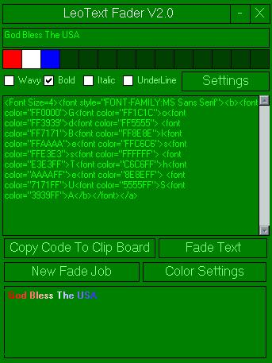



## \[ Aol, Cs, VbForums, and Yahoo Text Fader \]

### Description

Fade Text From one color to the next In Pratically any formate. Lot's more Function. Know with Preview In Rich Text Formate Whitch can be copyed instead of using Code. vbforms color compadible custom color code, fon, link and more. Started the fading funtion from scatch it is differnt form my other alot more compadible know all you do is put in the colors as a array then the text and it spits out the hex code for you. Added more Color setting re did the way i apply colors to each form totaly new program once again all my own code. Totaly 100% mine all pure VB Only one api call wicth is compadible with all systems. I have Frame less forms witch are compadible with all platforms to hope you enjoy and please vote for me. You also must have richtx32.ocs on your comp mostly all people do if not you can download it here http://www.leotown.com/fader/richtx32.ocx

For other code simulare to mine but not mine check out Chris O'Hara's code at http://www.planetsourcecode.com/vb/scripts/ShowCode.asp?txtCodeId=28687&lngWId=1 And Chris O'Hara Sorry if you thought i stool your code i did not.
 
### More Info
 
Text to fade, colors

code for faded text

             |
---                |---
**Submitted On**   |2002-02-02 20:00:38
**By**             |[Vblifeline](https://github.com/Planet-Source-Code/PSCIndex/blob/master/ByAuthor/vblifeline.md)
**Level**          |Intermediate
**User Rating**    |4.9 (64 globes from 13 users)
**Compatibility**  |VB 6\.0
**Category**       |[Internet/ HTML](https://github.com/Planet-Source-Code/PSCIndex/blob/master/ByCategory/internet-html__1-34.md)
**World**          |[Visual Basic](https://github.com/Planet-Source-Code/PSCIndex/blob/master/ByWorld/visual-basic.md)
**Archive File**   |[\[\_Aol\_Cs\_V52529222002\.zip](https://github.com/Planet-Source-Code/vblifeline-aol-cs-vbforums-and-yahoo-text-fader__1-31400/archive/master.zip)

